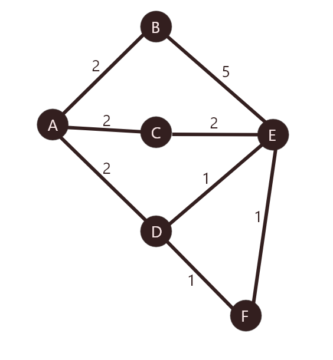

# Distributed-bellman-ford-algorithm
A distributed version of bellman ford algorithm, using multithreading and TCP sockets.

The code can be run in two different modes, a default mode ( Graph bellow), and a Customized mode in which you can define your own graph.

